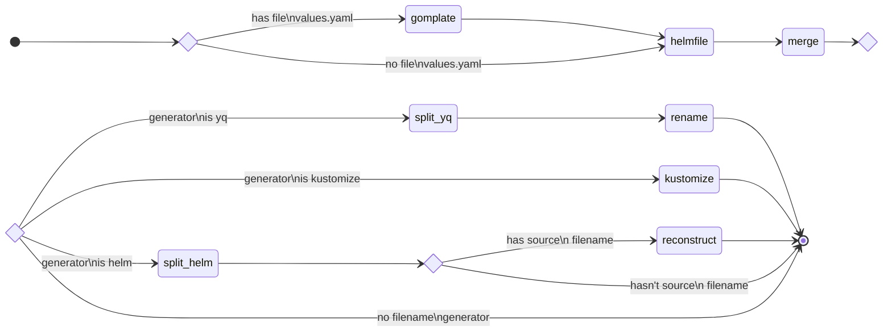

# kube-renderer
GitOps is very useful for continous deployment, for continous synchronization from Git to Kubernetes. Most common tool are ArgoCD, Flux, and others.
Common use-case is to prepare changes in deployment as a pull request when ops are able to validate changes before merging and propagating to cluster.

But this may be problematic sometime. When the pull request is about changes in Helm chart o Kustomize like new version of chart, changes in values or something equivalent in the Kustomize world, very small change in Git pull request may cause big changes in final manifests. Yes, the real change is visible in ArgoCD, but it may be too late (because of auto-sync for example).

Because of this some scenarios (especially system-level workload) uses pre-rendering from Helm/Kustomize/... at the level of Git repository and ArgoCD synchonizes final manifests, not Helm charts.

*And this is the job for **kube-renderer**.*

## background
**kube-renderer** is based on the following amazing tools (an alphabetical order):

* [bash](https://www.gnu.org/software/bash/) - yes, this is written in `bash`
* [bats](https://github.com/bats-core/bats-core) - every tool needs some tests
* [helm](https://helm.sh/) v3 - `helm` is the a hearth of helmfile and kube-renderer as well
* [helmfile](https://github.com/roboll/helmfile) - kube-renderer is based on multi-functional tool `helmfile` and process its input and output
* [kustomize](https://kustomize.io/) - `kustomize` is not only used by helmfile, but also is used as an alternative unique filename generator
* [yq](https://mikefarah.gitbook.io/yq/) v4 - `yq` is a multipurpose tool used for yaml files manipulation and as a customizable unique filename generator
* [gomplate](https://gomplate.ca/) - `gomplate` is a go-templates engine used for pre-rendering any files, but mainly used when helmfile doesn't support templating

Many thanks to authors of these tools.

## background of rendering process
**kube-render** rendering process consists of several phases (see diagram).

### gomplate
This phase is pre-rendering using gomplate.
It is conditioned by existing `values.yaml` file and during this phase
    all `*.gotmpl` files are processed by `gomplate` a then a suffix `.gotmpl` is removed.

### helmfile
This is the main phase when `helmfile template --include-crds --output-dir ...` process the input of `helmfile.yaml` file or `helmfile.d` directory.
This phase's result is an each `helmfile` release directory containing manifests rendered internally by `helm` command.

_Note: It is not possible to render single-file output using `helmfile template` without `--output-dir` option,
  because this way produces single file for all `helmfile` releases and then it is impossible to split manifests by release
  as an input for ArgoCD multiple Applications, for example._

### merge
_This is executed for each `helmfile` release separately._

This phase merges all manifest files (before later possible splitting) together to single manifest file.
This is because of unification output of different input kinds (helm / kustomize / plain), which are all processed by helm,
  but kustomize / plain input produces single output file (without original filename note)
  while helm produces multiple output files (with original filename note).
So for the helm it is possible to restore original filenames and for the others it doesn't matter.

### split_yq / split_helm
_This is executed for each `helmfile` release separately and only when **render filename generator** is `yq` or `helm`._

This phase splits previously merged manifest file to single-manifest files with unique name (number representing order in source file).
  This prevents having files with multiple manifests inside.

### rename
_This is executed for each `helmfile` release separately and only when **render filename generator** is `yq`._

This phase renames splitted manifests using specified or default **render filename pattern**. 

### kustomize
_This is executed for each `helmfile` release separately and only when **render filename generator** is `kustomize`._

This phase calls `kustomize build -o <DIRECTORY>` and produces single-manifest files with unique filenames,
  but without any possibility to customize filenames.

### reconstruct
_This is executed for each `helmfile` release separately and only when **render filename generator** is `helm`._

When single-manifest files contain note about original filename (these notes are produced by `helm`),
  original filenames are reconstructed. In some cases multiple manifests could be stored in single file.
