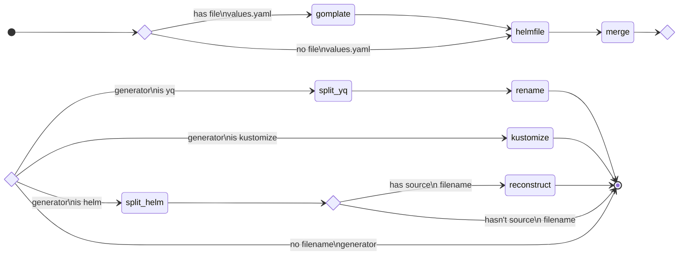

```mermaid
stateDiagram-v2
    direction LR
    state if_gomplate <<choice>>
    state if_source_filename <<choice>>
    state which_generator> <<choice>>
    state >which_generator <<choice>>

    [*] --> if_gomplate
    if_gomplate --> gomplate: has file\nvalues.yaml
        gomplate --> helmfile
    if_gomplate --> helmfile: no file\nvalues.yaml
    helmfile --> merge
    merge --> which_generator>

    >which_generator --> split_yq: generator\nis yq
        split_yq --> rename
        rename --> [*]
    >which_generator --> kustomize: generator\nis kustomize
        kustomize --> [*]
    >which_generator --> split_helm: generator\nis helm
        split_helm --> if_source_filename
        if_source_filename --> reconstruct: has source\n filename
            reconstruct --> [*]
        if_source_filename --> [*]: hasn't source\n filename
    >which_generator --> [*]: no filename\ngenerator
```
